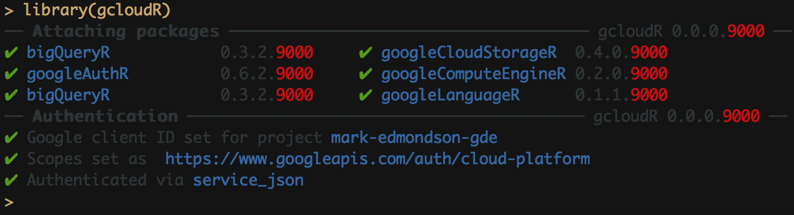

# gcloudR - load all Google Cloud packages

Inspired heavily by `tidyverse` and `aws.pack` this package is a helper to load all the `googleAuthR` Cloud based APIs.  It will then attempt to authenticate with them.

It also installs the latest versions of the digital marketing APIs, but won't attempt authentication as these are more likely to change from session to session.

